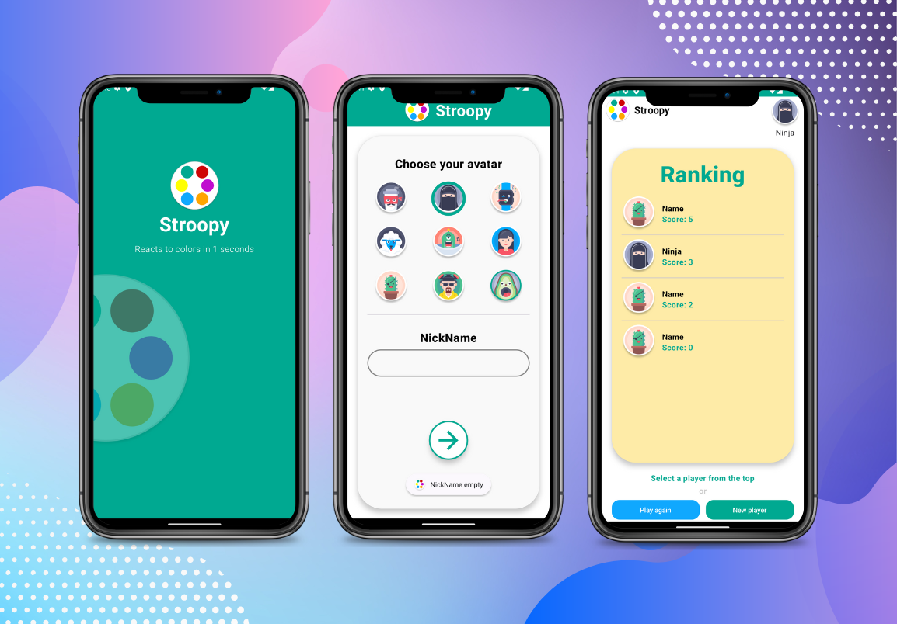

<h1 align="center">Stroopy</h1>

  
                 

  
🎮 Aplicacion android con enfoque practico, demuestra desarrollo android moderno con Jetpack Compose basado en inyeccion de dependencias, almacenamiento local con Room y manejo de estados a partir de un contador 👆

  
  

